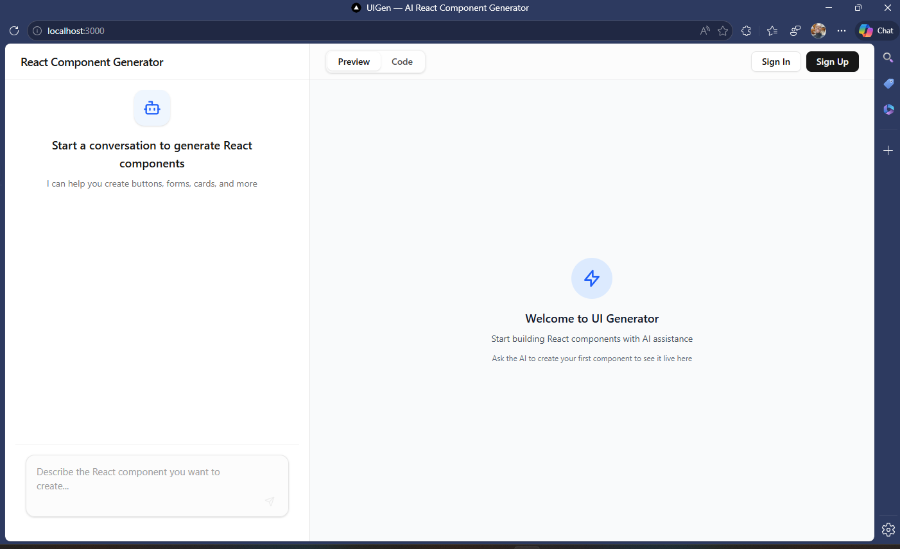

# UIGen

**AI-powered React component generator — describe in English, generate & iterate safely with live preview**

UIGen lets you chat with Claude to create, refine and preview production-grade React components in real time.
No free-form code hallucinations: Claude uses **structured tool calls** only (`str_replace_editor` + `file_manager`) to edit a **virtual in-memory filesystem**. Everything compiles and renders instantly in a sandboxed iframe — no files ever touch disk.

<p align="center">
  
  <br/>
  <em>Chat → Claude tool calls → Virtual FS updates → Babel → sandboxed iframe preview</em>
</p>

> **Sovereign stack:** UIGen is the cognition engine of the [KilimanjaroCode](https://github.com/KilimanjaroCode) sovereign stack. Cross-repo API schemas are governed by the [SOVEREIGN_CONTRACT](https://github.com/KilimanjaroCode/sovereign-contract) (v1.0).

[](https://nextjs.org/)
[](https://react.dev/)
[](https://tailwindcss.com/)
[](https://www.typescriptlang.org/)
[](https://anthropic.com)
[](https://github.com/SifisoScS/uigen/actions)
[](LICENSE)

---

## ✨ Why UIGen?

- **Safe generation** — Claude never writes raw code in messages; only structured edits via tools
- **Instant live preview** — Babel + esm.sh + import-map → sandboxed iframe (no network risk)
- **Iterative chat** — Refine forever: "add dark mode", "animate with Framer Motion", "extract a hook", "write tests"
- **Virtual filesystem** — In-memory only; JSON-persisted to SQLite for logged-in users
- **Monaco editor + file tree** — Edit, rename, and delete virtual files directly
- **No API key needed** — falls back to static mock tool calls and demo components
- **Export** — copy individual files or the whole virtual project

---

## Try the Demo (No API Key Needed)

Download seeded artifacts to experience governed publishing, remix chains, and lineage visualization — all in **mock mode, zero cost**:

**[⬇ v0.1.0-seed Release — 6 ready-to-run ZIPs](https://github.com/SifisoScS/uigen/releases/tag/v0.1.0-seed)**

Two lineage chains included:
- **AuthForm** — base form → dark mode toggle → Google OAuth + loading state
- **PricingCard** — base 3-tier cards → monthly/annual toggle → annual savings badges

```bash
# 1. Download any ZIP from the release page
unzip uigen-seed-auth-v1.2.0.zip -d my-auth-form
cd my-auth-form
npm install
npm run dev
# → open http://localhost:3000
```

Then explore `/registry` → click an artifact → `/share/[id]` for the manifest + ancestry chain → `/lineage/[id]` for the interactive pan/zoom provenance graph.

---

## Quick Start

```bash
git clone https://github.com/SifisoScS/uigen.git
cd uigen

# Install deps, generate Prisma client, run migrations
npm run setup

# Optional: real Claude gives the best experience
# cp .env.example .env.local
# → set ANTHROPIC_API_KEY=sk-ant-...

npm run dev
```

Open [http://localhost:3000](http://localhost:3000)
Sign up (or continue anonymously) → describe a component → watch it appear.

---

## Usage in 60 Seconds

1. **Describe** what you want:
   > "A responsive pricing card with 3 tiers, dark mode support, and hover effects"

2. Watch it **appear in the live preview** as Claude streams tool calls

3. Switch to the **Code tab** to inspect or edit the virtual files in Monaco

4. **Keep iterating**:
   > "Make the primary button use a gradient"
   > "Add Framer Motion fade-in on mount"
   > "Extract the pricing logic into a custom hook"

5. **Export** — copy files or download the project

---

## Features

| Feature | Description | Status |
|---|---|---|
| Structured Claude tool calls | `str_replace_editor` + `file_manager` — no uncontrolled code output | ✓ |
| Virtual FS (in-memory) | JSON-serializable; persisted per project for authenticated users | ✓ |
| Sandboxed JSX preview | `@babel/standalone` + `esm.sh` + importmap → isolated iframe | ✓ |
| Monaco + File Tree | Full editing, syntax highlighting, rename and delete | ✓ |
| Iterative multi-turn chat | Vercel AI SDK streaming, up to 40 tool rounds per request | ✓ |
| Auth + Persistence | JWT httpOnly cookies; `userId` optional on projects | ✓ |
| Project management | `/projects` list, inline rename, delete with confirmation | ✓ |
| Mock fallback | Static demo tool calls when `ANTHROPIC_API_KEY` is absent | ✓ |
| Rate limiting + Security | Per-IP sliding window, CSP headers, error boundaries | ✓ |
| Accessibility | `aria-live` strength meter, `aria-describedby` on inputs | ✓ |
| Testing & CI | 265+ Vitest + RTL tests · GitHub Actions (lint → tsc → test) | ✓ |
| Docker | Multi-stage Dockerfile + docker-compose with SQLite volume | ✓ |

---

## Tech Stack

| Layer | Technology |
|---|---|
| Framework | Next.js 15 (App Router) + React 19 |
| Language | TypeScript 5 (strict mode) |
| Styling | Tailwind CSS v4 + Radix UI + Shadcn UI |
| AI | Anthropic Claude via Vercel AI SDK + `@ai-sdk/anthropic` |
| Editor | Monaco Editor (`@monaco-editor/react`) |
| JSX Compiler | `@babel/standalone` (browser runtime) |
| Database | Prisma 6 + PostgreSQL (Neon); SQLite supported for local dev |
| Auth | JWT (`jose`) + bcrypt, httpOnly cookies |
| Testing | Vitest 3 + React Testing Library + JSDOM |

For deep architecture, directory layout, coding conventions, common pitfalls, testing guide, prompt design, and AI-assistant quick reference → read [**CLAUDE.md**](./CLAUDE.md)

---

## Environment Variables

Copy `.env.example` to `.env.local` and fill in as needed:

```env
ANTHROPIC_API_KEY=sk-ant-...      # Optional — omit to use the mock model
JWT_SECRET=change-me-in-prod      # Change in production
NODE_ENV=development              # Set to production for secure cookies
```

---

## Scripts

| Script | Description |
|---|---|
| `npm run setup` | Install deps + generate Prisma client + run migrations |
| `npm run dev` | Dev server with Turbopack |
| `npm run build` | Production build |
| `npm run test` | Run Vitest suite |
| `npm run lint` | ESLint |
| `npm run db:seed` | Seed demo lineage chains into the database |
| `npm run db:export-zips` | Export seeded artifacts as ZIP files to `exports/` |

---

## Docker

```bash
docker compose up --build
```

App available at [http://localhost:3000](http://localhost:3000). SQLite data persists in the `sqlite-data` volume.

---

## Contributing

Bug fixes, prompt improvements, new mock examples, multi-LLM support, additional a11y work — all welcome.

**Start here**: [**CLAUDE.md**](./CLAUDE.md) — everything an AI agent or human contributor needs: architecture decisions, tool definitions, key files, pitfalls, and testing guide.

---

## License

MIT © Sifiso Cyprian
